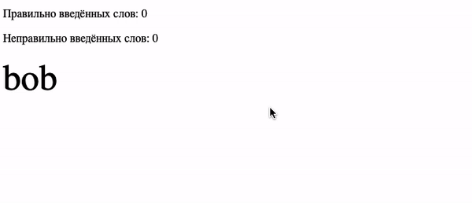

# Соло на клавиатуре

Домашнее задание к занятию 1.3 «Объект события».

## Описание 

Необходимо __дописать__ игру, в которой пользователь вводит слово по буквам с клавиатуры.
В случайное время появляется фраза. Если игрок вводит не так слово, 
ему засчитываeтся поражение. После 3 поражений игра заканчивается. 
Игрок побеждает после 10 побед.

### Исходные данные

1. Основная HTML-разметка
2. Базовая CSS-разметка
3. Базовый код игры

В настоящий момент в коде игры не хватает только обработчика ввода с клавиатуры 
для распознавания введённых символов и сравнении с текущим.

### Процесс реализации

Допишите метод *registerEvents*, в котором необходимо задать обработчик
нажатия клавиш. Принцип работы метода:

1. Получить DOM-элемент текущего символа, который необходимо ввести (свойство *this.currentSymbol*)
2. Получить символ, который был введён с клавиатуры. 
3. Если два символа одинаковые, вызывать метод *this.success*
4. Если два символа отличаются, вызвать метод *this.fail*
5. При сравнении регистр не должен быть важен (а или А)
